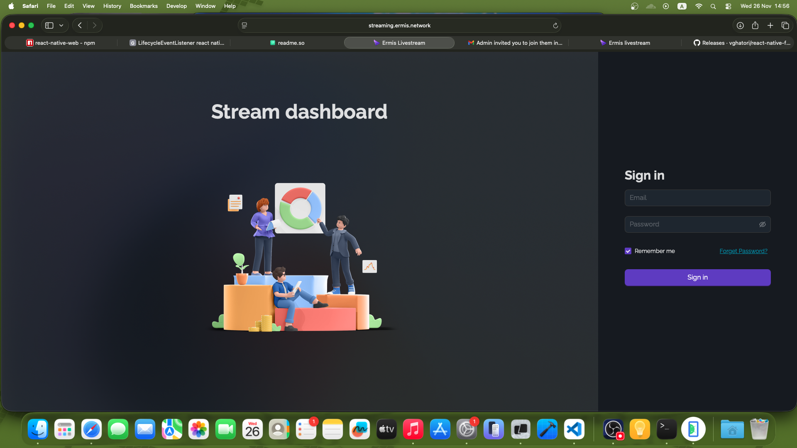
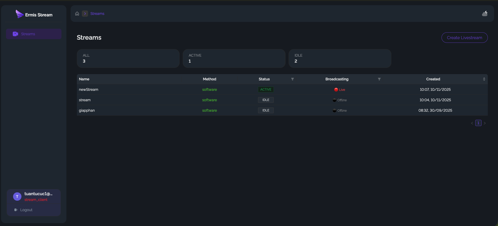
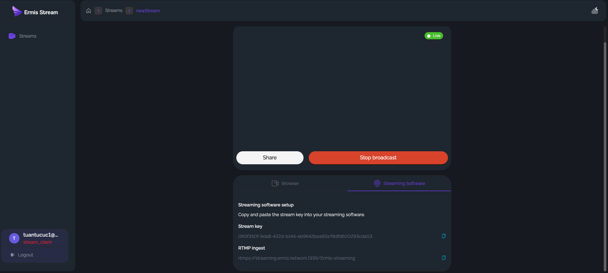
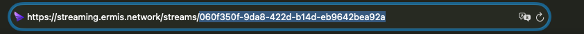
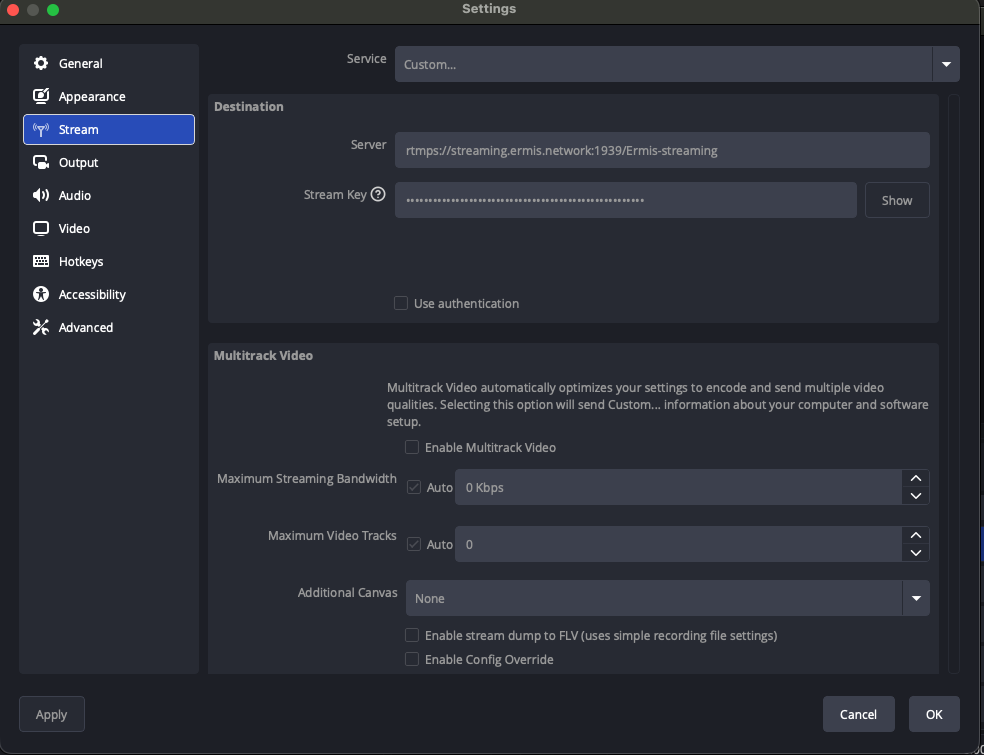

# react-native-fmp4_player_lib

an player stream's fmp4

## Installation


```sh
npm install react-native-fmp4_player_lib
```
## Require Version React 0.81 or newer

## Usage
   - Go to page https://streaming.ermis.network and click forget password to register email
   
   - Create live Stream
   
   - Get the stream key and rtmp Url
   
   - Get Stream Id from URL
    
   - Use OBS or Other Streaming software you have Paste the stream key and rtmp URL to Streaming SoftWare 
   
## Example
```js
// View
import { StreamView } from 'react-native-fmp4_player_lib';
// Function
import { startStreaming, stopStreaming } from 'react-native-fmp4_player_lib';


const [id, setId] = useState('');
//...
<StreamView streamId={id != '' ? id : ""}  style={{width:'100%', height:'30%'}}/>
            <Button title="Start Streaming" onPress={() => startStreaming()} />
            <Button title="Stop Streaming" onPress={() => stopStreaming()} />
            <TextInput
                  style={styles.input}
                  placeholder="Enter StreamId here"
                  onChangeText={newText => setText(newText)}
                  value={text}
            />

// set Stream Id Here or on your application UI
```


## Contributing

- [Development workflow](CONTRIBUTING.md#development-workflow)
- [Sending a pull request](CONTRIBUTING.md#sending-a-pull-request)
- [Code of conduct](CODE_OF_CONDUCT.md)


---

